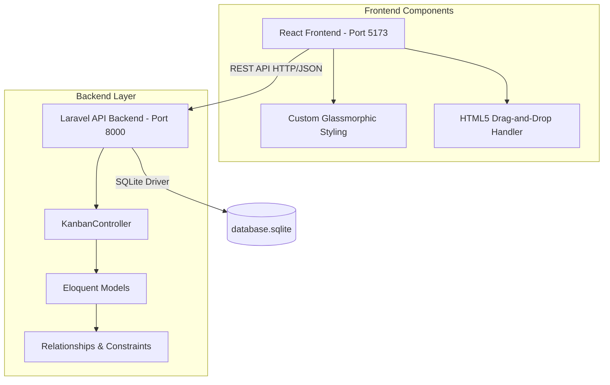

# System Architecture Document - KanbanFlow

This document describes the architectural design, database relationships, and frontend-backend communication patterns for the KanbanFlow application.

---

## Architecture Overview
KanbanFlow follows a decoupled client-server architecture:
- **Frontend (Client)**: A Single Page Application (SPA) built with React and Vite. It communicates with the backend via JSON REST APIs.
- **Backend (Server)**: A RESTful API built on Laravel, using SQLite for low-overhead database management.
- **Database (Relational)**: SQLite database storing Boards, Lists, Cards, Tags, and Members.

---

## Database Design & Eloquent Relationships

The application schema is modeled as a set of relational tables:
1. **Board** (1-to-many with List)
   - `id`, `name`, `timestamps`
2. **KanbanList** (belongs to Board, 1-to-many with Card)
   - `id`, `board_id`, `name`, `position`, `timestamps`
3. **Card** (belongs to List, many-to-many with Tag and Member)
   - `id`, `kanban_list_id`, `title`, `description`, `due_date`, `position`, `timestamps`
4. **Tag** (many-to-many with Card)
   - `id`, `name`, `color` (hex value), `timestamps`
5. **Member** (many-to-many with Card)
   - `id`, `name`, `email`, `avatar_url`, `timestamps`

### Pivot Tables
- **card_tag**: `card_id`, `tag_id` (Primary Key: `[card_id, tag_id]`)
- **card_member**: `card_id`, `member_id` (Primary Key: `[card_id, member_id]`)

---

## Key Technical Decisions & Data Flow

### 1. Position Reordering & Drag-and-Drop
To avoid heavy database recalculations and maintain high visual performance, the card dragging and dropping uses an optimistic UI approach:
1. On drop, the React frontend immediately reorders the local cards list and moves the card to the target list state.
2. The frontend sends an asynchronous `PUT /api/cards/{id}` request with the new list ID and position to the backend.
3. The Laravel backend runs a database reorder algorithm that updates positions of adjacent cards in the source and target columns to prevent position gaps.
4. If the API request fails, the frontend falls back and re-fetches the correct board state to prevent state desync.

### 2. Glassmorphic CSS Styling
Instead of importing large utility libraries (like TailwindCSS), the styling is built using **custom HSL variable tokens** and **native vanilla CSS**:
- Backdrop blur is handled natively via `backdrop-filter: blur(12px)`.
- Scrollbars are customized using standard `scrollbar-color` and `scrollbar-width` variables with legacy WebKit scrollbar pseudo-elements wrapped in `@supports not (scrollbar-color: auto)` overrides.
- This ensures maximum performance, zero styling bundle bloat, and highly polished visual aesthetics.
